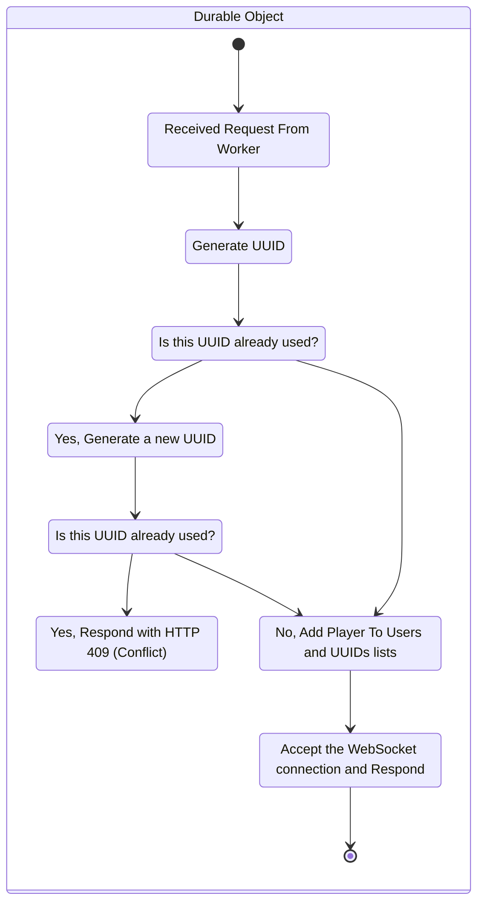

# Protocol

    This topic will define how the MXNet protocol works and is used.

<deflist>
    <def title="UUID">a universally unique identifier, also known as a GUID on Microsoft systems.</def>
</deflist>

The MXNet protocol is mostly based on requests, 

